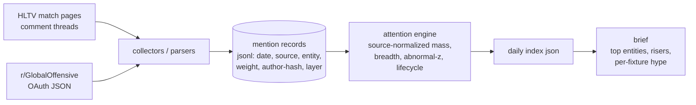

# cs-narrative-radar

Measure what the Counter-Strike community is *actually* paying attention to —
teams, players, storylines — from public community signals (HLTV match-thread
comments, r/GlobalOffensive), using methods borrowed from the investor-attention
and narrative-economics literature.

Built to answer a practical question: *coming into an event, which narratives
matter to the audience right now?* Raw mention counts can't answer it (big teams
always dominate). Deviation from an entity's own baseline can.


## Design decisions (and where they come from)

1. **Abnormal attention, not attention.** The core index is a robust z-score of
   today's engagement-weighted mention mass against the entity's own rolling
   baseline (median/MAD, log space) — the esports analogue of *abnormal search
   volume* from Da, Engelberg & Gao, ["In Search of Attention"](https://onlinelibrary.wiley.com/doi/10.1111/j.1540-6261.2011.01679.x)
   (J. Finance, 2011): levels measure popularity; deviations measure *news*.
2. **Narratives have lifecycles.** Each entity's z-series is tagged
   `dormant / emerging / peaking / fading`, the state view suggested by
   [Shiller's narrative-economics](https://www.nber.org/system/files/working_papers/w23075/w23075.pdf)
   epidemic framing (slow start → rapid rise → peak → decay, with possible
   mutation). Content timed at `emerging` beats content timed at `peaking`.
3. **Structured signals before text.** Entity resolution prefers signals that
   cannot be misread: HLTV fan-flair links (`/player/16163/hate` is
   unambiguous even though the player is named "hate"), profile links, match
   context — and only then dictionary matching over text, with an
   ambiguity gate for gamer tags that collide with English words
   (magic, device, rain, hope, forever...). Off-the-shelf NER breaks on
   these; domain lexicons are the documented fix (cf.
   [FeelsGoodMan](https://arxiv.org/pdf/2108.08411), Twitch neologisms).
4. **Breadth beats depth for robustness.** Unique-author counts ride beside
   engagement mass: 500 comments from 40 accounts is a different fact than
   500 comments from 400. Match-thread mining conventions follow the sports
   subreddit literature (e.g. [post-match fan behaviour](https://dl.acm.org/doi/fullHtml/10.1145/3544548.3581310),
   [Buzz to Broadcast](https://arxiv.org/pdf/2412.10298)).
5. **Attention first, valence later.** Volume and engagement answer "what are
   they thinking about"; polarity ("do they love or hate it") is a separate,
   harder problem. v0 ships one honest valence signal — HLTV users *declare*
   fan/hate allegiances in their flair — and leaves text polarity to a later
   domain-lexicon/LLM pass rather than pretending a general-purpose sentiment
   model understands "washed", "cracked" and "bot".

## Architecture



One deliberately boring data contract in the middle: every source reduces to
flat **mention records**, so adding a source never touches the math and the
math never touches a scraper.

## Quickstart

```bash
pip install -e .[dev,fast]     # 'fast' = lxml, ~10x quicker on big threads
pytest -q                      # hermetic: synthetic fixtures only

# parse a folder of saved HLTV match pages into mention records
radar parse-hltv --dir path/to/match_pages --entities data/sample_entities.csv --out mentions.jsonl

# snapshot r/GlobalOffensive (needs an approved Reddit script app — since
# the late-2025 Responsible Builder Policy, app creation requires a Data
# API access ticket first; see src/narrative_radar/reddit.py docstring.
# Set REDDIT_CLIENT_ID / REDDIT_CLIENT_SECRET / REDDIT_USER_AGENT)
radar reddit-snapshot --subreddit GlobalOffensive --out reddit.jsonl
radar reddit-mentions --snapshot reddit.jsonl --entities data/sample_entities.csv --out mentions.jsonl

# build the index and read the brief
radar index --mentions mentions.jsonl --out index.json
radar brief --index index.json --top 10
```

`data/sample_entities.csv` ships a small starter lexicon (top teams + a few
players, including ambiguous-tag examples). Point `--entities` at your own
fuller CSV; the format is documented in the file header.

## Data ethics / ToS

- Read-only public data, at gentle rates; Reddit access via its official
  OAuth API within free-tier limits.
- Outputs are **aggregates** (counts, scores, states). The tool does not
  republish user text or usernames; author identifiers are hashed before
  storage and used only for breadth counting.
- Respect the source sites: if you operate a collector, keep intervals modest
  and identify your client honestly.

## Status & roadmap

v0.1 (this repo): HLTV comment-thread parser (battle-tested against 10k+ real
pages), Reddit collector, entity lexicon with ambiguity gating, abnormal-
attention index + lifecycle states, CLI, CI, hermetic tests.

Next: per-fixture hype briefs keyed to an upcoming-match list; valence overlay
(declared-fan tallies now; domain-lexicon/LLM sampling later); attention-vs-
odds divergence studies (the finance-literature crossover this design exists
for); optional LLM narrative labeling over top threads (cf.
[LLM narrative identification](https://arxiv.org/pdf/2506.15041)).

## License

MIT
